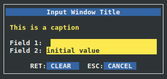

Input Window Example
--------------------

Source code for this example can be
found under examples/inputwin directory in the source tree.

This code example shows how to create a window that
contains some textboxes uses as input. The desired layout
for the window looks like this:

+------------------------------------------------+
|               Input Window Title               |
+================================================+
| This is a caption                              |
+-------------+----------------------------------+
| Field 1:    |[###############]                 |
+-------------+----------------------------------+
| Field 2:    |[initial value########]           |
+-------------+----------------------------------+
|        RET:[ CLEAR  ]  ESC:[ CANCEL ]          |
+------------------------------------------------+

XML Code
^^^^^^^^

First, we need to define the color pairs::

    <xml>
        <colors>
            <color name="win"     foreground="white"  background="black" />
            <color name="title"   foreground="white"  background="blue"  />
            <color name="caption" foreground="yellow" background="black" />
            <color name="table"   foreground="green"  background="black" />
            <color name="field"   foreground="yellow" background="black" />
            <color name="button"  foreground="white"  background="blue"  />
        </colors>

I used to name the color pairs after the element types for which they are going 
to be used. For example, the pair named "caption" will always be used
for caption elements. Give yourself a moment to insect the values of
'foreground' and 'background' attributes and imagine how the final
window will be like. Now we move to the window layout::

    <windows>
        <window name="wininput" width="50%" height="10" color="win">

The name 'wininput' will be used by the python code to reference
this window. A width of 50% of terminal width and a height
of 10 rows is enough for a small input window like this.

Now we layout the window elements. We have these elements:

1. **Title:**

    We want to define a title with 'Input Window Title' text
    centered in the window::

        <title name="" text="Input Window Title" color="title" />

2. **Caption:**

    We want to define a caption with 'This is a caption' text
    aligned to the left. It is good practice to insert
    an empty line above and below the caption to make some space::

        <caption name="" text="                   " align="left" color="caption" />
        <caption name="" text=" This is a caption " align="left" color="caption" />
        <caption name="" text="                   " align="left" color="caption" />

3. **Fields:**

    Insert two fields that span the whole width for the window::

        <field name="field1" title="Field 1:" text="" width="100%" color="field" />
        <field name="field2" title="Field 2:" text="" width="100%" color="field" />

    The names 'field1' and 'field2' will be used by python code to reference
    the fields. You can set the 'text' attribute for the second field
    to 'initial value', however, I chose to do that in python code for
    education purposes. It is good practice to add another empty line::

        <caption name="" text="" align="left" color="caption" />

4. **Button Box:**

    Finally, we add a button box with two buttons: clear and cancel::

        <buttonbox name="box" color="button">
            <button key="RET" text=" CLEAR  " />
            <button key="ESC" text=" CANCEL " />
        </buttonbox>

    The name 'box' will be used by python code to reference the
    button box and add actions for "RET" and "ESC" keys.

In the end, we close the "window", "windows", and "xml" tags::

            </window>
        </windows>
    </xml>

**Full code for the XML file <curses.xml>**::

    <xml>
        <colors>
            <color name="win"     foreground="white"  background="black" />
            <color name="title"   foreground="white"  background="blue"  />
            <color name="caption" foreground="yellow" background="black" />
            <color name="table"   foreground="green"  background="black" />
            <color name="field"   foreground="yellow" background="black" />
            <color name="button"  foreground="white"  background="blue"  />
        </colors>
        <windows>
            <window name="wininput" width="50%" height="10" color="win">

                <title   name="" text="Input Window Title" color="title" />

                <caption name="" text="                   " align="left" color="caption" />
                <caption name="" text=" This is a caption " align="left" color="caption" />
                <caption name="" text="                   " align="left" color="caption" />

                <field   name="field1" title="Field 1:" text="" width="100%" color="field" />
                <field   name="field2" title="Field 2:" text="" width="100%" color="field" />

                <caption name="" text="" align="left" color="caption" />

                <buttonbox name="box" color="button">
                    <button key="RET" text=" CLEAR  " />
                    <button key="ESC" text=" CANCEL " />
                </buttonbox>

            </window>
        </windows>
    </xml>

Python Code
^^^^^^^^^^^

Shebang::

    #!/usr/bin/env python2

Include xmlcurses module::

    import xmlcurses

We first need to initialize the library::

    # initialize xmlcurses    
    xmlcurses.init()

Load the XML file::

    # parse xml file
    xmlcurses.parse("curses.xml")

Fetch "wininput" object::

    # get window instance
    win = xmlcurses.getWinByName("wininput")

Now we need to get instances for the field elements::

    # get text fields
    field1 = win.getElementByName("field1")
    field2 = win.getElementByName("field2")

Initialize field2 as we explained above::

    # set an initial value for field 2
    field2.setText("initial value")

We want to set the actions as follows:

    * When the user presses on "RET", the 'CLEAR' button
      clears field1 and field2.
    * When the user presses on "ESC", the window is closed.

This can be achieved using very simple code::

    # set button actions
    box = win.getElementByName("box")
    box.setAction("RET", lambda: [f.setText('') for f in [field1, field2]])
    box.setAction("ESC", lambda: win.hide())

Finally we display the window::

    # show the window
    win.show()

**Full python code <inputwin.py>**::

    #!/usr/bin/env python2

    import xmlcurses

    # initialize xmlcurses    
    xmlcurses.init()

    # parse xml file
    xmlcurses.parse("curses.xml")

    # get window instance
    win = xmlcurses.getWinByName("wininput")

    # get text fields
    field1 = win.getElementByName("field1")
    field2 = win.getElementByName("field2")

    # set an initial value for field 2
    field2.setText("initial value")

    # set button actions
    box = win.getElementByName("box")
    box.setAction("RET", lambda: [f.setText('') for f in [field1, field2]])
    box.setAction("ESC", lambda: win.hide())

    # show the window
    win.show()

Final Result
^^^^^^^^^^^^

When the code is executed, the window is shown on terminal:

