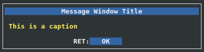

Message Window Example
----------------------

Source code for this example can be
found under examples/msgwin directory in the source tree.

This code example shows how to create a window that
works as a message prompt (similar to MsgBox() in Visual Basic 6).

+------------------------------------------------+
|              Message Window Title              |
+================================================+
| This is a caption                              |
+------------------------------------------------+
|                 RET:[   OK   ]                 |
+------------------------------------------------+

XML Code
^^^^^^^^

First, we need to define the color pairs::

    <xml>
        <colors>
            <color name="win"     foreground="white"  background="black" />
            <color name="title"   foreground="white"  background="blue"  />
            <color name="caption" foreground="yellow" background="black" />
            <color name="table"   foreground="green"  background="black" />
            <color name="field"   foreground="yellow" background="black" />
            <color name="button"  foreground="white"  background="blue"  />
        </colors>

I used to name the color pairs after the element types for which they are going 
to be used. For example, the pair named "caption" will always be used
for caption elements. Give yourself a moment to insect the values of
'foreground' and 'background' attributes and imagine how the final
window will be like. Now we move to the window layout::

    <windows>
        <window name="winmsg" width="50" height="7" color="win">

The name 'winmsg' will be used by the python code to reference
this window. A width of 50 columns and a height
of 10 rows is enough for a small message window like this.

Now we layout the window elements. We have these elements:

1. **Title:**

    We want to define a title with 'Message Window Title' text
    centered in the window::

        <title name="" text="Message Window Title" color="title" />

2. **Caption:**

    We want to define a caption with 'This is a caption' text
    aligned to the left. It is good practice to insert
    an empty line above and below the caption to make some space::

        <caption name="" text="                   " align="left" color="caption" />
        <caption name="" text=" This is a caption " align="left" color="caption" />
        <caption name="" text="                   " align="left" color="caption" />

3. **Button Box:**

    Finally, we add a button box with one buttons::

        <buttonbox name="box" color="button">
                <button key="RET" text="   OK   " />
        </buttonbox>

    The name 'box' will be used by python code to reference the
    button box and add an action for "RET" key.

In the end, we close the "window", "windows", and "xml" tags::

            </window>
        </windows>
    </xml>

**Full code for the XML file <curses.xml>**::

    <xml>
        <colors>
            <color name="win"     foreground="white"  background="black" />
            <color name="title"   foreground="white"  background="blue"  />
            <color name="caption" foreground="yellow" background="black" />
            <color name="table"   foreground="green"  background="black" />
            <color name="field"   foreground="yellow" background="black" />
            <color name="button"  foreground="white"  background="blue"  />
        </colors>
        <windows>
            <window name="winmsg" width="50" height="7" color="win">

                <title name="" text="Message Window Title" color="title" />

                <caption name="" text="" align="left" color="caption" />

                <caption name= "msg" text=" This is a caption " align="left" color="caption" />

                <caption name="" text="" align="left" color="caption" />
                
                <buttonbox name="box" color="button">
                    <button key="RET" text="   OK   " />
                </buttonbox>

            </window>
        </windows>
    </xml>

Python Code
^^^^^^^^^^^

Shebang::

    #!/usr/bin/env python2

Include xmlcurses module::

    import xmlcurses

We first need to initialize the library::

    # initialize xmlcurses    
    xmlcurses.init()

Load the XML file::

    # parse xml file
    xmlcurses.parse("curses.xml")

Fetch "winmsg" object::

    # instantiate window
    win = xmlcurses.getWinByName("winmsg")

We want to set the actions as follows:

    * When the user presses on "RET" button, the window is closed.

This can be achieved using very simple code::

    # set button actions
    win.getElementByName("box").setAction("RET", lambda: win.hide())

Finally we display the window::

    # show the window
    win.show()

**Full python code <msgwin.py>**::

    #!/usr/bin/env python2

    import xmlcurses

    # initialize xmlcurses    
    xmlcurses.init()

    # parse xml file
    xmlcurses.parse("curses.xml")

    # instantiate window
    win = xmlcurses.getWinByName("winmsg")

    # set button actions
    win.getElementByName("box").setAction("RET", lambda: win.hide())

    # show the window
    win.show()

Final Result
^^^^^^^^^^^^

When the code is executed, the window is shown on terminal:

