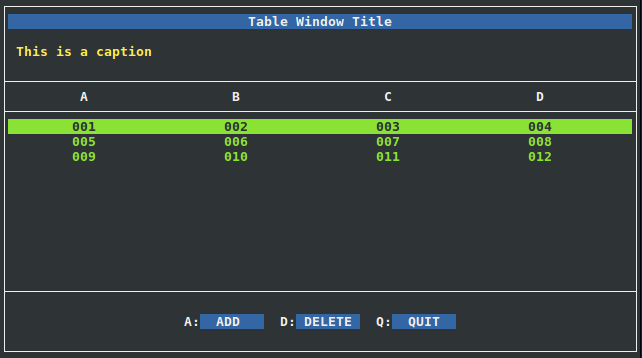

Table Window Example
--------------------

Source code for this example can be
found under examples/tblwin directory in the source tree.

This code example shows how to create a window that
contains a table. The desired layout for the window 
looks like this:

+------------------------------------------------------------------------------+
|                              Table Window Title                              |
+==============================================================================+
| This is a caption                                                            |
+-------------------+-------------------+------------------+-------------------+
|         A         |         B         |        C         |         D         |
+-------------------+-------------------+------------------+-------------------+
|        001        |        002        |       003        |        004        |
+-------------------+-------------------+------------------+-------------------+
|        005        |        006        |       007        |        008        |
+-------------------+-------------------+------------------+-------------------+
|        009        |        010        |       011        |        012        |
+-------------------+-------------------+------------------+-------------------+
|                   |                   |                  |                   |
+-------------------+-------------------+------------------+-------------------+
|                   |                   |                  |                   |
+-------------------+-------------------+------------------+-------------------+
|                   |                   |                  |                   |
+-------------------+-------------------+------------------+-------------------+
|                   A:[  ADD   ]  D:[ DELETE ]  Q:[  QUIT  ]                   |
+------------------------------------------------------------------------------+

XML Code
^^^^^^^^

First, we need to define the color pairs::

    <xml>
        <colors>
            <color name="win"     foreground="white"  background="black" />
            <color name="title"   foreground="white"  background="blue"  />
            <color name="caption" foreground="yellow" background="black" />
            <color name="table"   foreground="green"  background="black" />
            <color name="field"   foreground="yellow" background="black" />
            <color name="button"  foreground="white"  background="blue"  />
        </colors>

I used to name the color pairs after the element types for which they are going 
to be used. For example, the pair named "caption" will always be used
for caption elements. Give yourself a moment to insect the values of
'foreground' and 'background' attributes and imagine how the final
window will be like. Now we move to the window layout::

    <windows>
        <window name="wintable" width="100%" height="100%" color="win">

The name 'wintable' will be used by the python code to reference
this window. We want the window to span the whole terminal screen size,
therefore a width and a height of "100%" each are defined.

Now we layout the window elements. We have these elements:

1. **Title:**

    We want to define a title with 'Table Window Title' text
    centered in the window::

        <title name="" text="Table Window Title" color="title" />

2. **Caption:**

    We want to define a caption with 'This is a caption' text
    aligned to the left. It is good practice to insert
    an empty line above and below the caption to make some space::

        <caption name="" text="                   " align="left" color="caption" />
        <caption name="" text=" This is a caption " align="left" color="caption" />
        <caption name="" text="                   " align="left" color="caption" />

3. **Table:**

    We want to define a table with four columns, A, B, C, and D::

        <table name="tbl" cols="A,B,C,D"  height="100%" color="table" />

    The height of the table will span the remaining space inside
    the window, after we keep out the title, captions, and buttonbox
    elements, as well as window borders.

4. **Button Box:**

    Finally, we add a button box with three buttons: add, delete, and quit::

        <buttonbox name="box" color="button">
            <button key="A" text="  ADD   " />
            <button key="D" text=" DELETE " />
            <button key="Q" text="  QUIT  " />
        </buttonbox>

    The name 'box' will be used by python code to reference the
    button box and add actions for "A", "D", and "Q" keys.
    It is good practice to add an empty line at this point
    to keep some space between the button box and the bottom
    border::

        <caption name="" text="" align="left" color="caption" />

In the end, we close the "window", "windows", and "xml" tags::

            </window>
        </windows>
    </xml>

**Full code for the XML file <curses.xml>**::

    <xml>
        <colors>
            <color name="win"     foreground="white"  background="black" />
            <color name="title"   foreground="white"  background="blue"  />
            <color name="caption" foreground="yellow" background="black" />
            <color name="table"   foreground="green"  background="black" />
            <color name="field"   foreground="yellow" background="black" />
            <color name="button"  foreground="white"  background="blue"  />
        </colors>
        <windows>
            <window name="wintable" width="100%" height="100%" color="win">

                <title   name="" text="Table Window Title" color="title" />

                <caption name="" text="                   " align="left" color="caption" />
                <caption name="" text=" This is a caption " align="left" color="caption" />
                <caption name="" text="                   " align="left"  color="caption" />

                <table   name="tbl" cols="A,B,C,D"  height="100%" color="table" />

                <caption name="" text="" align="left" color="caption" />

                <buttonbox name="box" color="button">
                    <button key="A" text="  ADD   " />
                    <button key="D" text=" DELETE " />
                    <button key="Q" text="  QUIT  " />
                </buttonbox>

                <caption name="" text="" align="left" color="caption" />

            </window>
        </windows>
    </xml>

Python Code
^^^^^^^^^^^

Shebang::

    #!/usr/bin/env python2

Include xmlcurses module::

    import xmlcurses

First, we create a function that generates values for table cells::

    # generate numbers
    seq = 0
    def genNum():
       global seq
       seq += 1
       return "%03d" % seq 

A row is defined as a dictionary whose keys are column names::

    # generate row
    def genRow():
        return {"A": genNum(), "B": genNum(), 
                "C": genNum(), "D": genNum()}

Now we can initialize the library::

    # initialize xmlcurses    
    xmlcurses.init()

Load the XML file::

    # parse xml file
    xmlcurses.parse("curses.xml")

Fetch "wintable" object::

    # get window instance
    win = xmlcurses.getWinByName("wintable")

Add three rows to the table::

    # add some rows to the table
    tbl = win.getElementByName("tbl")
    tbl.addRow(genRow())
    tbl.addRow(genRow())
    tbl.addRow(genRow())

We want to set the actions as follows:

    * When the user presses on "A", a new row is added.
    * When the user presses on "D", the selected row is deleted.
    * When the user presses on "Q", window is closed.

This can be achieved using very simple code::

    # set button action
    box = win.getElementByName("box")
    box.setAction("A", lambda: tbl.addRow(genRow()))
    box.setAction("D", lambda: tbl.delRow(tbl.getSelRowIndex()))
    box.setAction("Q", lambda: win.hide())

Finally we display the window::

    # show the window
    win.show()

**Full python code <tblwin.py>**::

    #!/usr/bin/env python2

    import xmlcurses

    # generate numbers
    seq = 0
    def genNum():
       global seq
       seq += 1
       return "%03d" % seq 

    # generate row
    def genRow():
        return {"A": genNum(), "B": genNum(), 
                "C": genNum(), "D": genNum()}

    # initialize xmlcurses
    xmlcurses.init()

    # parse xml file
    xmlcurses.parse("curses.xml")

    # get window instance
    win = xmlcurses.getWinByName("wintable")

    # add some rows to the table
    tbl = win.getElementByName("tbl")
    tbl.addRow(genRow())
    tbl.addRow(genRow())
    tbl.addRow(genRow())

    # set button action
    box = win.getElementByName("box")
    box.setAction("A", lambda: tbl.addRow(genRow()))
    box.setAction("D", lambda: tbl.delRow(tbl.getSelRowIndex()))
    box.setAction("Q", lambda: win.hide())

    # show the window
    win.show()

Final Result
^^^^^^^^^^^^

When the code is executed, the window is shown on terminal:

